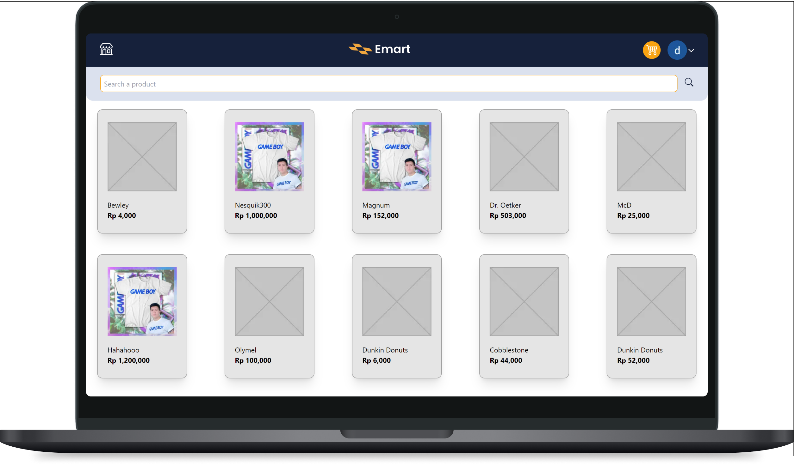
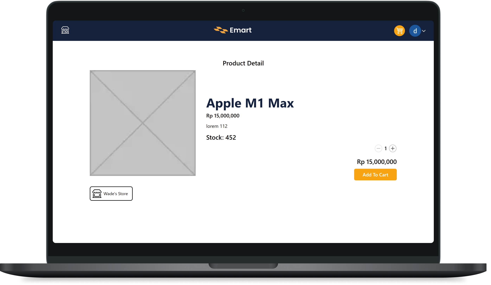
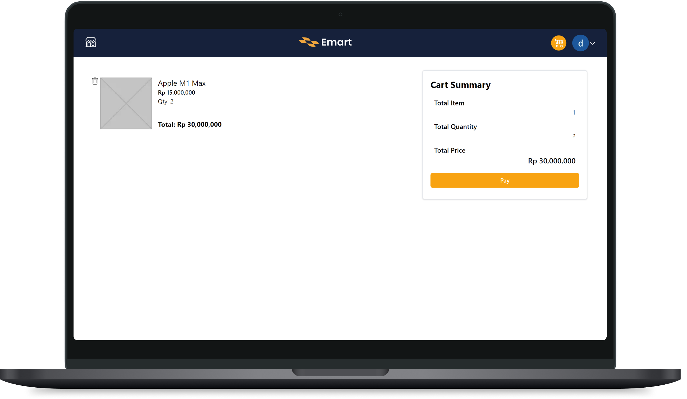
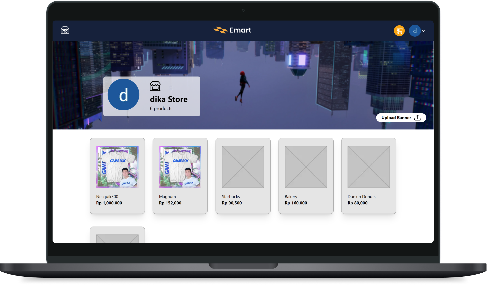
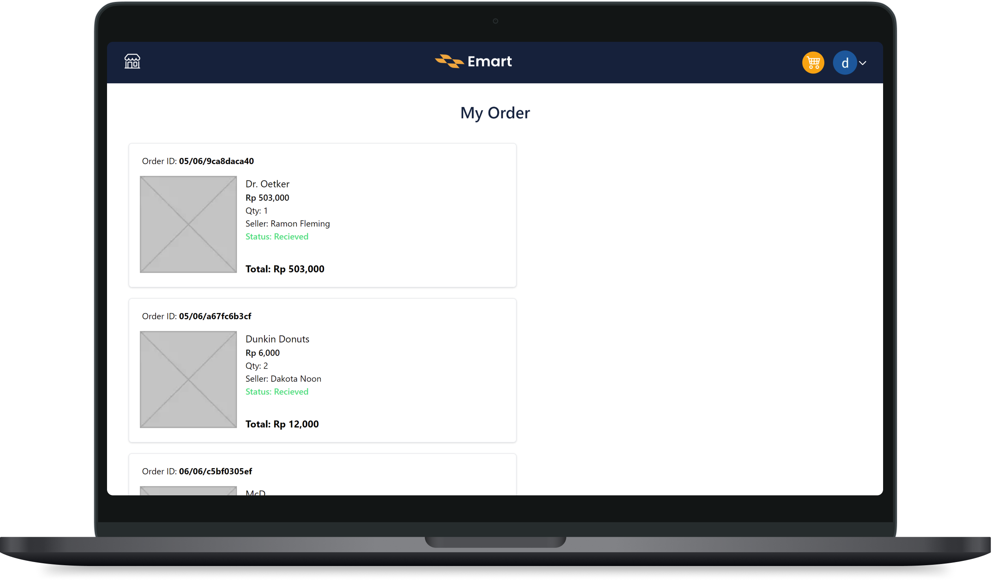

# Emart Project



This is a project for one of my college subject, that is Workshop on Implementing Software Design. The main idea is creating a ecommerce that has a seller and buyer and this platform supposedly provides the needed feature. The project made with NextJS, and uses nextauth for the serverless open authentication and also uses an object relational mapper called Prisma to do a query to the database which currently deployed to Digital Ocean. NextJS came quite handy with the built in API so it allows us to create a serverless application while having the functionality to do so.

## Features


1. Home page with search bar
   - The searchbar will query to the DB onchange and debounced for 300ms

<br/> 
<br/>



2. Product detail
   - If you're the owner of the product, instead of add-to-cart option you'll get edit/delete product option

<br/>
<br/>


3. Cart
   - Currently there is no payment option so if you press the pay button it'll just be a dummy payment and your order will be set to success and it'll show in my-order page

<br/>
<br/>


4. My store
   - This page will show the product of the respective seller. If you open your own store, it'll show the upload banner button to customize your store's backdrop.

<br/>
<br/>


5. My order
   - This page shows what you've ordered before, for example you checked out from the cart page then it'll show here. There are few state of the order, that are ordered, sent, and received.

## How to use

```bash
git clone https://github.com/Dwikavindra/crudwrpl
npm install
```

After that setup the required environment variables at the root directory such as below
`.env`

```bash
DATABASE_URL=xxxxxxxxxxxxxx #database URL for Prisma
GOOGLE_CLIENT_ID=xxxxxxxxxxxxxxxx #your google OAuth client ID
GOOGLE_CLIENT_SECRET=xxxxxxxxxxxxxx #your google OAuth client secret
REACT_APP_FIREBASE_KEY=xxxxxxxxxxxxxxx #your firebase key to store the product image
NEXT_PUBLIC_JWT_SECRET=xxxxxxxxxxxxxxx #your JWT secret
```

Finally, run the program with

```bash
npm run dev
```
